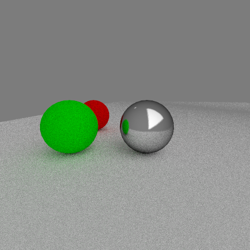

# raycaster-tira

[Project definition](https://github.com/kluopaja/raycaster-tira/blob/master/doc/project_specification.md)

[Week report 1](https://github.com/kluopaja/raycaster-tira/blob/master/doc/week_reports/week1.md)

[Week report 2](https://github.com/kluopaja/raycaster-tira/blob/master/doc/week_reports/week2.md)

[Week report 3](https://github.com/kluopaja/raycaster-tira/blob/master/doc/week_reports/week3.md)

[Week report 4](https://github.com/kluopaja/raycaster-tira/blob/master/doc/week_reports/week4.md)

[Week report 5](https://github.com/kluopaja/raycaster-tira/blob/master/doc/week_reports/week5.md)

[Code coverage report](https://kluopaja.github.io/raycaster-tira/doc/coverage/coverage.html)

## Building

The program uses the following libraries:
* assimp
* tbb (needed only for multithreading)
* Googletest (only for testing)
* Googlemock (only for testing)

The program can be compiled with command `make` in `src/` directory.
To include the multithreading support, compile the program with
`make enable_parallel=1`

## Testing

Tests can be run with the command `make test` and the code coverage report
can be generated with the command `make coverage`. Note that some of
the performance tests fail when running `make coverage` because the
compiler optimizations are not used.

## Usage

Currently the only way to use the program is to modify the `main()` function.
By default the main function should generate the following image (in PPM format):

Here's also the older image for fun:

